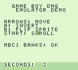

# Game Boy Emulator

A Nintendo Game Boy (DMG) emulator written in C11. SDL2 handles the window
and keyboard input. Cinoop by CTurt was a useful reference for the design
([article](https://cturt.github.io/cinoop.html), [code](https://github.com/CTurt/Cinoop)).

There is no sound emulation. The sound registers accept writes, but no audio
is produced. See [Unsupported features](#unsupported-features).



---

## What It Emulates

It supports ROM-only, MBC1, MBC3 (including the real-time clock), and MBC5
cartridges. The main emulated hardware includes:

- The complete Sharp LR35902 instruction set, including all CB-prefixed
  opcodes, with cycle counts.
- The memory bus, with all regions of the memory map.
- Cartridge loading and header checks.
- Interrupts.
- The timer.
- The PPU: background, window and sprites, with scanline timing.
- The joypad.
- A console debugger.

The CPU passes all 11 of Blargg's `cpu_instrs` tests and `instr_timing`.

## How It Fits Together

The code is split into one module per hardware component. As in Cinoop,
components talk to each other only through the memory bus
(`readByte`/`writeByte`):

```
                 +-----------+
   main.c  --->  | emulator  |  one step = cpuStep() then timer/serial/PPU
   (SDL2)        +-----------+  advance by the same number of cycles
     |                 |
  display.c        cpu.c ----> memory.c (bus) ----+--> cartridge.c (ROM, MBCs, RAM)
  (texture)          |              |             +--> ppu.c       (FF40-FF4B, VRAM, OAM)
                     |              |             +--> timer.c     (FF04-FF07)
               interrupts.c         |             +--> input.c     (FF00)
                                    |             +--> serial.c    (FF01-FF02)
                                    +--> WRAM/HRAM/IE, sound regs (stored only)
```

| File | Cinoop equivalent | Purpose |
|------|-------------------|---------|
| `registers.h` | `registers.h` | Register union (`registers.a` / `registers.af`) |
| `instructions.c` | the instruction table in `cpu.c` | Disassembly, operand length and cycles per opcode |
| `cpu.c` | `cpu.c`, `cb.c` | Fetch, decode and execute; HALT, STOP and EI |
| `memory.c` | `memory.c` | Address decoding, I/O dispatch, OAM DMA |
| `cartridge.c` | `rom.c` | Loading, header parsing, MBC1, MBC3 (+RTC), MBC5 |
| `interrupts.c` | `interrupts.c` | IE, IF, IME, priority and dispatch |
| `timer.c` | none (Cinoop uses `rand()`) | DIV, TIMA, TMA, TAC |
| `ppu.c` | `gpu.c` | Modes, scanline renderer, STAT |
| `input.c` | `keys.c` | Joypad register P1 |
| `serial.c` | none | Link port with nothing attached (used by test ROMs) |
| `debugger.c` | `debug.c` | Console debugger |
| `display.c`, `main.c` | `display.c`, `main.c` | SDL2 window, events, frame pacing |

For the module layout and frame loop, see [docs/architecture.md](docs/architecture.md).
The CPU, memory, PPU, timer, cartridge, and interrupt details each have their
own document in `docs/`.

## Building

- GCC via MinGW-w64. Tested with WinLibs GCC 16.1 UCRT.
- CMake 3.16 or newer
- Ninja
- SDL2 development files for MinGW. A copy of SDL2 2.32.10 is included in
  `third_party/SDL2`, so the build needs no internet access.

To install the tools with winget:

```bash
winget install BrechtSanders.WinLibs.POSIX.UCRT Kitware.CMake Ninja-build.Ninja
```

```bash
cmake -S . -B build -G Ninja -DCMAKE_BUILD_TYPE=Release
```

```bash
cmake --build build
```

This builds `build/gameboy-emulator.exe` and `build/gb_tests.exe`. To make a
debug build, replace `Release` with `Debug`.

SDL2 is linked statically by default, so the executable does not need a
separate `SDL2.dll`. To link it dynamically, configure with
`-DGB_SDL2_STATIC=OFF`; CMake copies `SDL2.dll` next to the executable. To use
a different SDL2 installation, pass `-DSDL2_DIR=<folder containing sdl2-config.cmake>`.

## Running a Game

```bash
build/gameboy-emulator.exe path/to/game.gb
```

| Option | Meaning |
|--------|---------|
| `-h`, `--help` | Show help |
| `-d`, `--debug` | Start paused in the console debugger |
| `-s`, `--scale N` | Window scale, 1 to 10 (default 4, giving 640×576) |
| `-k`, `--keys FILE` | Load a key mapping file (see `keys.example.cfg`) |
| `--bootrom FILE` | Run your own 256-byte DMG boot ROM first |
| `--trace FILE` | Write an instruction trace (`-` for stdout) |
| `--serial` | Print bytes sent over the link port (used by test ROMs) |
| `--info` | Print the cartridge header and exit |
| `--headless` | Run without a window |
| `--frames N` | Quit after N frames (headless default 600) |
| `--screenshot FILE` | Save the last frame as a PNG when quitting |

The homebrew ROMs in `roms/` are enough to try the emulator. For other games,
use ROMs you are legally entitled to use:

```bash
build/gameboy-emulator.exe roms/demo.gb
```

When you quit, battery-backed cartridge RAM and the MBC3 clock are saved to
`<rom>.sav`.

## Controls

| Game Boy | Key | | Emulator | Key |
|----------|-----|-|----------|-----|
| D-pad | Arrow keys | | Quit | Esc |
| A | X | | Pause | P |
| B | Z | | Fast forward (hold) | Tab |
| Start | Enter | | Reset | F2 |
| Select | Backspace | | Screenshot (PNG) | F12 |
| | | | Break into debugger | Space or F1 |

The default keys follow Cinoop's layout. To change them, pass a config file
with `--keys file.cfg`; each line maps a Game Boy button to an SDL key name,
for example `A = X`. See `keys.example.cfg` for the full format.

### Debugger

Start the emulator with `--debug`, or press Space or F1 while it runs, then
type commands in the console window:

```
s [n]  step        c  continue        f  run one frame
b XXXX breakpoint  d XXXX delete      w XXXX break on write
r  registers       i  I/O registers   m XXXX [n] dump memory
u [XXXX] [n] disassemble              t  toggle trace     q  quit
```

## Supported Cartridges

| Code | Type |
|------|------|
| 0x00 | ROM ONLY (32 KiB) |
| 0x01 | MBC1 |
| 0x02 | MBC1+RAM |
| 0x03 | MBC1+RAM+BATTERY (`.sav` files) |
| 0x08 | ROM+RAM |
| 0x09 | ROM+RAM+BATTERY |
| 0x0F, 0x10 | MBC3+TIMER(+RAM)+BATTERY. The real-time clock follows your PC's clock and is saved in `.sav` in the BGB/VBA-M format |
| 0x11, 0x12, 0x13 | MBC3, MBC3+RAM, MBC3+RAM+BATTERY |
| 0x19–0x1B | MBC5, MBC5+RAM, MBC5+RAM+BATTERY |
| 0x1C–0x1E | MBC5+RUMBLE variants (the rumble motor is ignored) |

Other mapper types are not supported. For example, an MBC2 ROM reports its
cartridge type and that it is unsupported.

Games marked Game Boy Color–only (CGB flag 0xC0) load, but most of them
detect the original Game Boy and show a "GBC only" screen, just as they
would on real DMG hardware.

## Unsupported Features

- Sound and the APU. Sound-register writes are stored, but there are no audio
  channels or audio output. NR52 reports that all channels are off.
- MBC2, MMM01, MBC6, MBC7, HuC1/HuC3 and other rare mappers
- Game Boy Color and Super Game Boy features
- A real link-cable partner. Serial transfers complete as if nothing were
  connected.

## Testing

```bash
ctest --test-dir build --output-on-failure
```

- `gb_tests` has 8 suites with about 1,500 checks: cpu, memory, cartridge,
  interrupts, timer, ppu, input and integration. The integration suite runs
  the homebrew ROMs.
- If you put Blargg's `cpu_instrs.gb` and `instr_timing.gb` in
  `build/test-roms/` and re-run CMake, CTest also runs them. Both pass.

See [docs/testing.md](docs/testing.md) for details.

## Known Limitations

- The PPU draws a whole scanline at the end of mode 3, as Cinoop does, and
  mode 3 always lasts 172 cycles. Raster effects that change registers in the
  middle of a scanline are not reproduced.
- CPU timing is correct per instruction, but memory accesses within an
  instruction are not timed individually. Tests that measure access timing,
  such as `mem_timing`, are not targeted.
- OAM DMA copies all 160 bytes instantly. VRAM and OAM are always accessible,
  with no mode 2 or mode 3 lockout.
- Minor hardware quirks are not modelled: the LY=153 early reset, the DMG
  STAT write glitch, and OAM corruption.

## Cinoop Reference

CTurt's *Cinoop* article was the main reference for the module layout and
development order. A few parts needed changes for DMG behavior:

- DIV returning `rand()` is replaced by a real timer.
- There is no game-specific patch like the "block writes to 0xFF80" Tetris
  hack.
- MBC1 is added.
- The window, 8×16 sprites, sprite priority and STAT interrupts are added.

See [docs/architecture.md](docs/architecture.md#what-comes-from-where).

## License

MIT (see `LICENSE`). SDL2 in `third_party/SDL2` is under the zlib license
(`third_party/SDL2/LICENSE.txt`).
